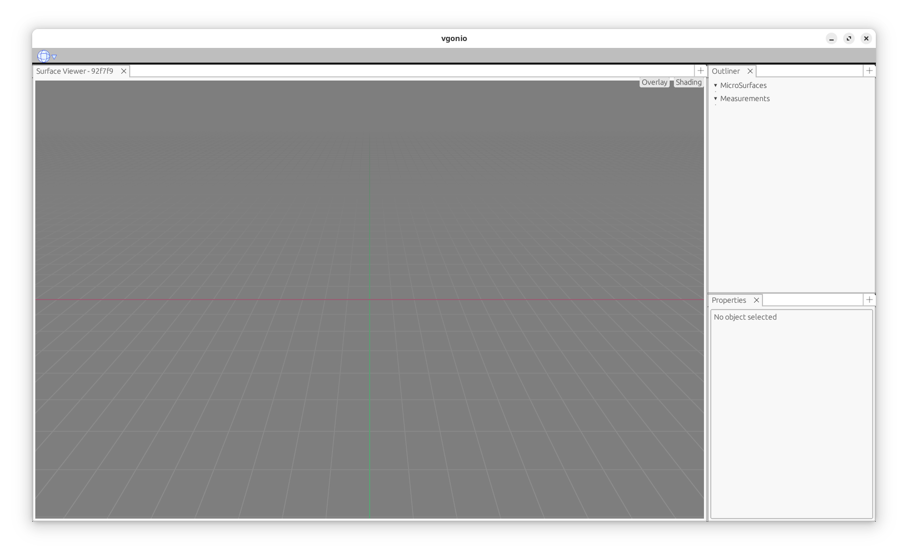
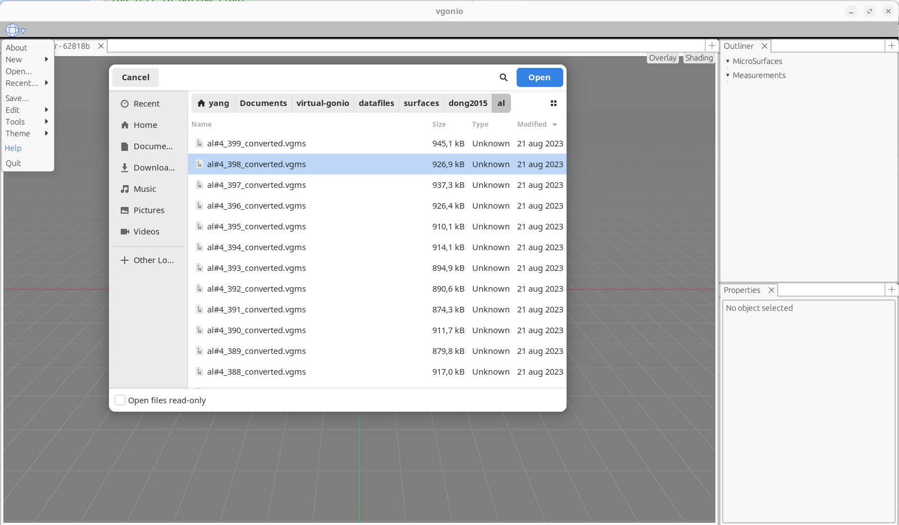
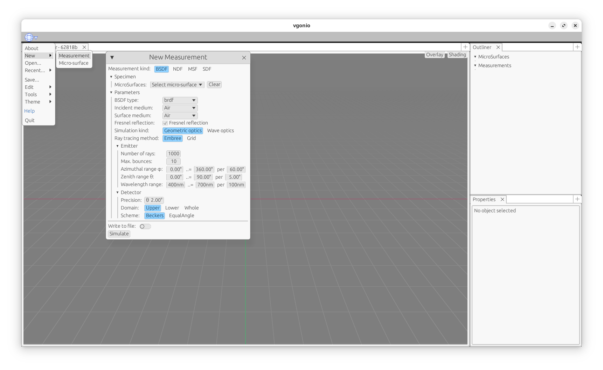

# VGonio

VGonio is a tool designed to measure the geometric properties of materials described by microfacet-based BRDF
models. By analyzing a material's microstructure, VGonio can estimate the Normal Distribution Function (NDF), the
Geometric Attenuation Function (GAF), and the Bidirectional Reflectance Distribution Function (BRDF). This tool is
specifically created to tackle the complexities associated with multiple scattering phenomena in BRDF models, offering a
thorough analysis of the material's behaviour.

## Status

VGonio is currently in active development. There are still many potential features and improvements that can be made,
and the API is subject to change. *Expect breaking changes!*

Current features that are being worked on:

* Data fitting
* Multiple scattering data analysis
* Wave optics simulation

## File Organization

* `crates/` - Contains the source code for the VGonio library.
* `scripts/` - Contains scripts for generating figures from collected data.
* `meas/` - Contains the descriptions of the measurements.

## Documentation

The documentation can be built using `cargo doc -p vgonio --open --no-deps`. The documentation is generated using
`rustdoc` and can be viewed in the browser. Extra HTML header content will be added to support latex math rendering by
setting the `rustdocflags` in
`./cargo/config.toml`.

Do **NOT** use `cargo doc --open` as it will generate documentation for all crates in the workspace, which will mess up
documentation dependencies.

Possible workarounds are to either add
`--no-deps` to the `cargo doc`, or use `cargo rustdoc` to generate documentation only for the root crate(this crate).
For more information, see cargo issue [#331](https://github.com/rust-lang/cargo/issues/331)
and rust pull request [#95691](https://github.com/rust-lang/rust/pull/95691).

## Building from Source

You can download the latest source code of VGonio from
the [releases page](https://github.com/matthiascy/vgonio/releases)
or clone the repository using Git:

```shell
git clone https://github.com/matthiascy/vgonio.git
```

### Installing Rust

VGonio is written in Rust, so you need to have Rust installed on your system to build it. You can install Rust by
following the instructions on the [official website](https://www.rust-lang.org/tools/install).

As VGonio relies on some unstable features, you need to use the nightly version of Rust. After installing Rust and
cloning the repository, you can switch to the nightly version specified in the `rust-toolchain.toml` file by running:

```shell
rustup component add --toolchain nightly-2024-06-28
```

### Installing Dependencies

Currently, VGonio depends on the following libraries:

* [shaderc](https://github.com/google/shaderc)
* [Embree v3.13.5](https://www.embree.org/):
  You can simply download the precompiled binaries from the [Embree website](https://www.embree.org/downloads.html)
  and extract them to the root directory of VGonio.
* [zlib](https://zlib.net/) or [zlib-ng](https://github.com/zlib-ng/zlib-ng)

The default cargo build uses [sccache](https://github.com/mozilla/sccache) and [mold](https://github.com/rui314/mold) to
speed up the build process. If you don't have them installed, you can disable them by commenting out the `rustc_wrapper`
and `rustflags` in `./cargo/config.toml` under the `[build]` section.

```toml
[build]
rustc_wrapper = ["sccache"] # use sccache as compiler wrapper
rustflags = ["-Clink-arg=-fuse-ld=mold"] # use mold as linker
```

### Compiling

Running the following command in the root directory of the repository will compile the VGonio tool:

```shell
cargo build --release
```

Once the build process is complete, you can find the compiled binaries in the `target/release` directory.

### Configurations

The VGonio tool uses a configuration file to specify the data directories and other settings.

VGonio can run with different configuration files:

1. You specify the configuration file while launching the application. It will read the file if it exists.
2. If there is a file named as `vgonio.toml` exists in the working directory where the application launched, it will try
   to read this config file.
3. If 1. and 2. failed, it will read the config file `vgonio.toml` in folder `SYS_CONFIG_DIR/vgonio` if exists.

In the root directory of the repository, you can find the configuration file `vgonio.toml` that you can modify to
specify the data directories and other settings.

```toml
triangulation = "top-left-to-bottom-right"
output_dir = "~/Documents/virtual-gonio/output"
data_dir = "~/Documents/virtual-gonio/datafiles"
```

You should modify the `output_dir` and `data_dir` fields to point to the directories where you want to store the output
data and the data files, respectively. The required `ior` files are already included in the repository, you should copy
them to the `data_dir` directory you specified in the configuration file.

## Usage

VGonio provides a command-line interface (CLI) and a graphical user interface (GUI) for the measurement and analysis of
BRDF data.

### Graphical User Interface

Simply run the compiled binary without any subcommands starts directly the GUI:

```shell
./target/release/vgonio
```



The Menu is located in the top left corner of the window.
To start a new measurement, the surface must be loaded first. To do this,
click in the `Open` menu and select the surface file (by default, VGonio will open the directory specified by the
`data_dir` field in the configuration file).



Then, you can start the measurement by clicking on the `Measure` button. All possible measurement settings will show up
in a pop-up window.



Start the measurement by clicking on the `Simulate` button. If `Write to file` is checked, the measurement data will be
saved to files in the output directory specified in the configuration file.

## Command-Line Interface

### Measurement

The `measure` subcommand is used to measure different properties of the material depending on the measurement
description.
The measurement description is a YAML file that specifies the measurement settings.
For each kind of measurement, we provide a template file in the `meas/` directory named with corresponding measurement
kind.

```shell
vgonio measure -i <measurement_description>...
```

For example, to measure the BRDF of a surface, you can run the following command:

```shell
vgonio measure -i meas/brdf.yaml
```

Note that to specify multiple measurement descriptions, you can use the `-i` flag multiple times. The surface file path
specified in the measurement description should be an absolute path or a path relative to the data directory specified
in the configuration file (`data_dir`). The specified data directory can be referenced using `usr://` in the measurement
description.

### Plotting

The `plot` subcommand is used to plot the measured data.

## File Formats

The VGonio tool has its own file formats for storing the measured data and the surface data. To not confuse the file
formats, we use the `.vgms` extension for the surface data and the `.vgmo` extension for the measurement output data.

**NOTE**: these file formats do **not** guarantee any backwards or forwards compatibility. One version of VGonio may not
be able to read the files generated by another version.

See the [file formats documentation](./FORMATS.md) for more information.

## Contributing

Found a bug or have a feature suggestion? Your feedback is highly appreciated!

Share your thoughts and report any issues on the [issue tracker](https://github.com/matthiascy/vgonio/issues).

## License

VGonio is distributed under the terms of the Apache License (Version 2.0).

See [LICENSE](LICENSE) for details.